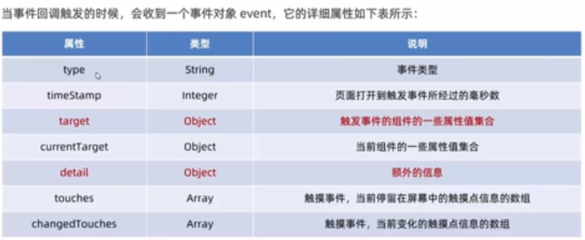
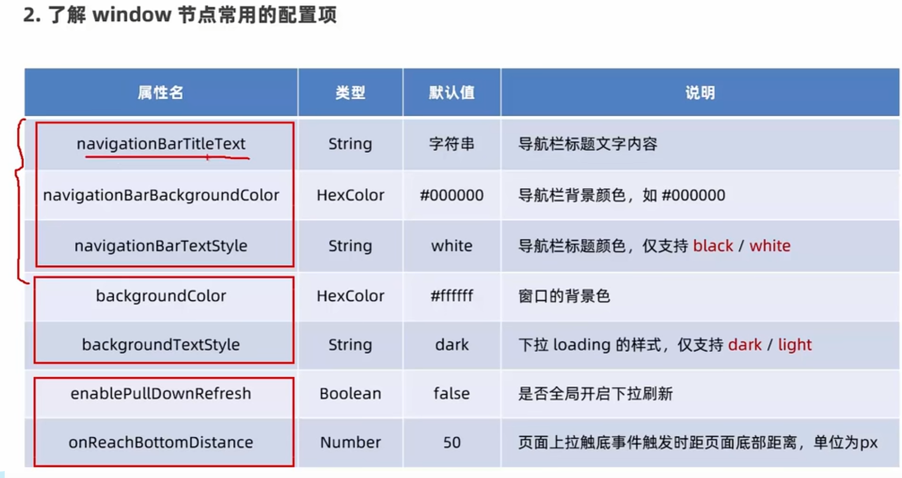

app.json 全局配置，包括了小程序的所有页面路径、窗口外观、界面表现、底部tar等
{
  "pages":[
    "pages/index/index",
    "pages/logs/logs"
  ],
  "window":{
    "backgroundTextStyle":"light",
    "navigationBarBackgroundColor": "#fff",
    "navigationBarTitleText": "Weixin",
    "navigationBarTextStyle":"black"
  },
  "style": "v2",
  "sitemapLocation": "sitemap.json"
}

- pages:用记录当前小程序所有页面的路径
- window：全局定义小程序所有页面的背景色、文字颜色等
- style: 全局定义小程序组件所使用的样式版本
- sitemapLocation: 用来指明sitemap.json

# WXML模板

- view text image navigator(导航跳转)
- 提供了Vue中的模板语法

# 宿主环境

# 组件

  text 相当于html的span
  view 相当于html的div 嵌套完成页面上的布局
  image 相当于image
  icon
  navigator 跳转

# 常用的视图容器类组件

- view
  - 普通视图区域
  - 类似div
  - 常用来实现页面的布局效果
- srcoll-view
  - 可滚动的视图区域
  - 常用来是实现滚动列表效果
- swiper 和 swiper-item
  -轮播图容器组件和轮播图item组件
- `<text selectable>`130387832982 `</text>`
- `<rich-text nodes="<h1 style='color : red'>标题</h1>"/>`
- 其他常用的组件
  - button
    - 按钮组件
    - 通过open-type属性可以第哦啊用微信提供的各种功能
  - image
    - 图片组件
    - image组件默认宽高为300.240
  - navigator
    - 页面导航组件
    - 类似a链接
- 小程序宿主环境
  - API，调用API获取用户信息、本地存储、支付功能等。
  - 分类
    - 事件监听API
      - 特点：以on开头，用来监听某些事件的触发
      - wx.onWindowResize)(function callback) 监听窗口尺寸变化的事件
    - 同步api
      - 特点：以Sync结尾
      - 同步api的执行结果，可以通过函数返回值直接获取，如果执行出错会抛出异常
      - wx.setStorageSync('key','value')向本地存储写入内容
    - 异步API
      - 类似于jQuery中的$.ajax(options)函数，需要通过success、fail、complete接收调用的结果。
      - wx.request()发起网络数据请求，通过success回调函数接收数据。
- 协同工作和发布
  
- 发布
  - 开发版本
  - 体验版本
  - 审核版本
  - 线上版本
- 小程序上线的步骤
  - 上传代码 -> 提交审核 -> 发布
  - 上传代码
    > 点击上传
    > 填写版本号和项目备注
    >
- wxml模板语法-数据绑定
  - 数据绑定的基本原则
    - 在data中定义数据
      - 在js文件中，data中应用数据
    - 在wxml中使用数据
      - mustache语法
  - 事件绑定，渲染层到逻辑层的通讯方式
    - tap 手指触摸后马上离开 bindtap
    - input 文本框的输入事件 bindinput
    - change 状态改变时触发 bindchange
  - 事件对象的属性列表
  - 
- target/currentTarget
  - target是触发该事件的源头组件，currentTarget则是当前时间所绑定的组件
- 在事件处理函数中为data中的数据赋值
  - 通过调用this.setData()方法，给data中的数据重新赋值
    ```javascript
    CountChange(e){
    this.setData({
    count: this.data.count +1
    })
    console.log(this.data.count)
    },
    ```
  - 事件传参
    - data-* *代表的是参数的名字
    - <button type="primary" bindtap="btnTap2" data-info="{{2}}"> +2</button>
    - e.target.dataset.info
      -bindinput 语法格式
  - 通过bindinput，为文本框绑定输入事件
- 全局配置
  - 导航栏 窗口背景 下拉
  - 
